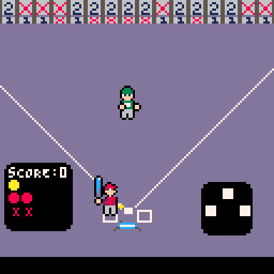

## Pico8 Dev Log - Blitzball Game 

I thought it was about time to start a devblog for the Pico8 game that I'm working on. What started as a little side project is quickly becoming one of my favorite things to work on in some of my downtime...and it's fun!  

## The game

The game I'm making is based on the plastic baseball game called Blitzball, specifically Jomboys iteration of it. If you haven't seen it you can check it out [here.](https://www.youtube.com/watch?v=0PSkYgZHw-8&t=575s)

### The Basics
- It's played indoors where singles/doubles/homeruns are determined by where the ball is hit
- 5 strikes, 4 balls
- The ball moves extra funky due to the nature of the blitzball

### What I'd like to do 
My idea is take the Blitzball game is to simulate the blitzball game as much as I can with some additions 

#### Planned Features
- The back wall will randomly change so its a new game every time
- Two player with a customized amount of innings
- Customizable Rules 
    - Max outs
    - Max strikes
    - Max balls 
    - Team colors
- Rougelike Cards to alter gameplay (for example)
    - Faster Pitching
    - Change Wall configuration 
    - Smaller/Bigger strike zone

There is more to the rougelite elements that I'm interested in...I'm still mulling this over.

## What I have so far

- Main rules
- NPC pitcher that throws randomly in towards the zone
- A random generated wall for Doubles (2) Singles (1) and Outs (x)
- Player Controlled Batter
- Written in a paired down version of Lua
- Has its own testing suite that I built from the ground up
- Scorebug with Balls, Strikes, Score, Outs
- A "ghost runner" graphic that shows where batters are on base.

I'm excited to work on this further!

