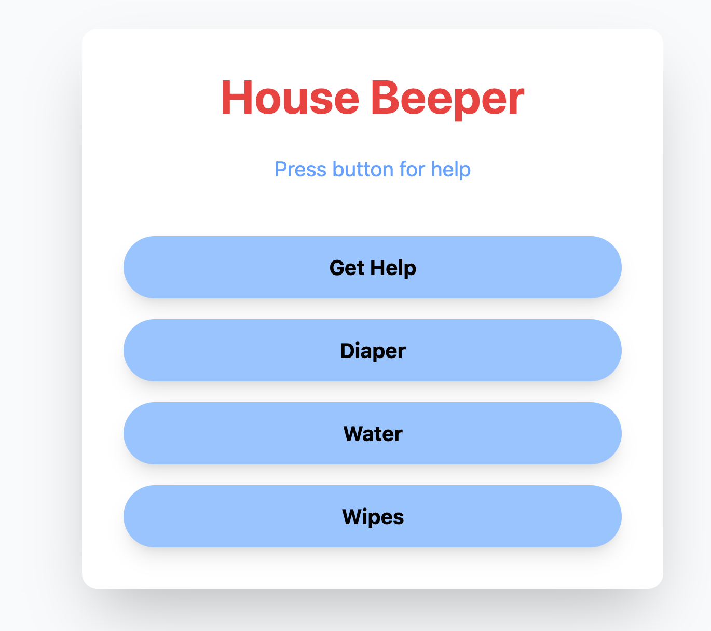

# Housebeeper
Fun side project to utilize ntfy and flask to send messages one handed via PWA. Made because we have a thousand fans on and I can't hear my wife across the apartment. 

## Why 

Trying to get help with a baby while not screaming to wake said baby in a house full of fans is....difficult. I tried to think of a way for my wife and I to communicate one handed with a phone instead of trying to actually type something. 

Most of my self projects are vast in scope, so I wanted to try to think of a very simple, very basic application to give flask a test run. I also thought it might be _nice_ to try not to lean on react and use Vanilla JS/Jquery instead just for the challenge. I also wanted to make something with NTFY since I've heard about it and never used it. 

## Technologies Used:
- Flask
- Self hosted ntfy instance.
- Tailwind 
- Jquery

## Selfhosted what now?
I like to hoard old computers/laptops and make servers out of them, and right now I have a small closet running a 10 year old laptop that I'm using to run CasaOS, a selfhosted UI Dashboard. I've been using it for about a year or so and its a really addictive way to tinker and to keep things out of landfills! Really easy to pick up and learn on the fly, especially if you have some docker knowhow

## The Python
This is actually a very simple Flask application 


Two main routes, `/` and `/send`. One returns a html template and one handles sending notifications to NTFY
```
@app.route("/")
def index():
    return render_template("index.html")


@app.route("/send", methods=["POST"])
def send_message():
    data = request.get_json()
    if not data:
        return jsonify({"error": "No data provided"}), 400
    msg = data.get("msg")
    requests.post(
        "http://192.168.0.234:7200/zach_alerts",
        data=msg,
        headers={"Title": "Needed!", "Priority": "urgent", "Tags": "baby"},
    )
    print(f"Rec:{msg}")

    return jsonify({"status": "Success"}), 200
```

## The HTML/JS


I'm pretty happy that I stuck to a very, very minimal approach to the HTML here. It's supposed to be quick and snappy. 

The JS is pretty straight forward...used Jquery for sake of ease.  Basically create an array of `label` and `message` and render buttons with it. Created a helper function called `btnMaker` to make creating buttons a little less of a pain 

### JS
```
<script>
      $(document).ready(function () {
        console.log("page ready!");
        const btns = [
          {
            label: "Get Help",
            message: "Help",
          },
          {
            label: "Diaper",
            message: "Need Diapers",
          },
          {
            label: "Water",
            message: "Need Water",
          },
          {
            label: "Wipes",
            message: "Need Wipes",
          },
        ];
        $.each(btns, (i, btn) => {
          btnMaker(btn.label, btn.message, i);
        });
      });

```
### btnMaker

Heres `btnMaker`... Find the main `btns` div, make a button element with some tailwind classes and add the `label` to the text and `msg` to the onClick event in a `sendMessage` service
```
const btnMaker = (label, msg,id) => {
    const $btnDiv = $('#btns')
    let $btnElement 
    if ($btnDiv) {
        $btnElement = $("<button>", {
            id: `btn${id}`,
            class: 'w-full sm:w-auto bg-blue-300 hover:bg-blue-700 font-bold py-3 px-8 rounded-full transition duration-200 shadow-lg cursor-pointer',
            text: label,
        })
        $btnElement.click(() => {
            sendMessage(msg)
        })
        $btnDiv.append($btnElement)
    }  
}
```

### sendMessage
Really straight forward `fetch` call here, just sending the `msg` to the `/send` route.
```
const sendMessage = (msgContent) => {
        fetch("/send", {
          headers: {
            "Content-Type": "application/json",
          },
          method: "POST",
          body: JSON.stringify({ msg: msgContent }),
        })
          .then(() => console.log("Help signal sent successfully."))
          .catch((error) =>
            console.error("Failed to send help signal:", error),
          );
};
```