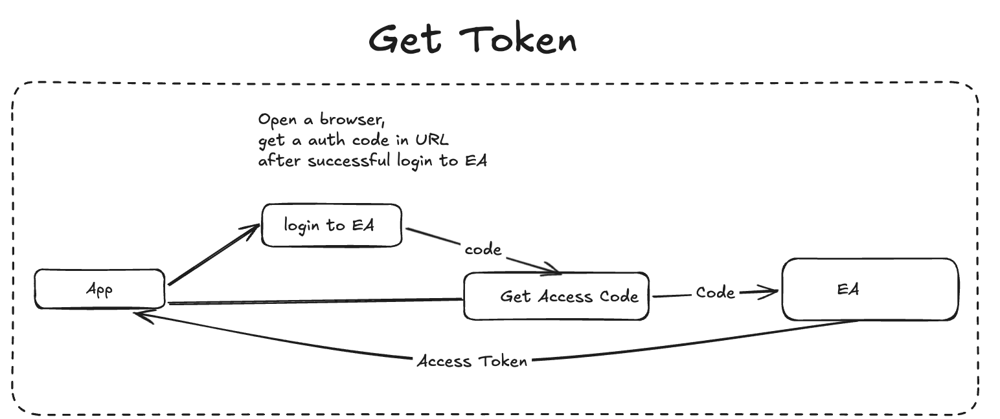
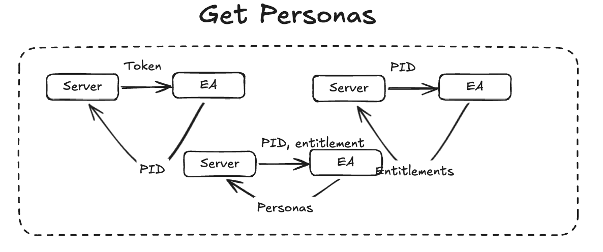
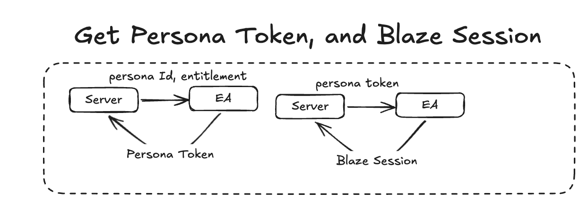

# Where we are going, we won't need an App

> If you want to go right to my repo and see the project, you can see it [here!](https://github.com/zdenardi/madden_exporter)

If you haven't read my first blog post about this, let me give you a rundown of what is going on.

My friends and I play in a Madden Connected Franchise and we really wish there was a way to be more connected with our franchise, but the Madden Companion App leaves a lot to be desired. The companion app lets you export league data, but only to someone else's service. Naturally, my first thought was: why can't I export it to my own

There is a companion app that allows a user to see the current week, and the ability to export the league data to a third party source and that is where my interest was piqued. It's just a URL that you can send a request to and I had a great idea...why can't I just export it to my own app?


## Forgoing the app entirely  

Looking at the Madden Companion App (MCA), I noticed that it looked pretty webby. It launched on a phone sure, but I had a sneaky assumption that it was a PWA wrapped in a pretty package and if that was the case, then it has to be making API requests that I should be able to use for my own purposes. 

### How is that any different than the last step?
Before, I was trying to setup a service that would allow me to capture data the MCA was sending after I used it. If I pressed "Export" it would do some behind the scenes magic, and then hit my custom endpoint, giving me the data. This way, I can make the behind scene magic myself and then forgo having to use the app.
 
### Why build this?

The reason I want to do this other than being a really cool side project is that it allows me to create features that aren't implemented / are not important to EA such as...

- Notifying the League when we have advanced weeks 
- Being able to vote on a force advancement
- Being able to look at stats on a phone/laptop/web interface
- Having AI powered press conferences
- Having generated Newspaper/Tweet/Headlines about our games
- Track trends on how the game is going and if the game difficulty needs to be changed. 

Really, the features are endless, and being able to update without intervention is a huge win.

## How the EA Service works
Thank god for a guy named Snallabot who figured out how EA authenticates to make this a little easier, but here is a quick run down. It's a little convoluted, but I'm guessing that has to do with the sheer size of EA.

At a high level, EA's authentication is a multi-step process:

- Authenticate with your EA account.
- Retrieve your game personas.
- Exchange that information for a persona token.
- Create a Blaze session used for game-specific requests.


This step has you logging into your account on EA, which in turn sends a redirect to a specified URL with a param of a code. You can then use that code to authenticate with the EA services to get a Auth Token. 

I think about this step of logging into the main portal of EA. You walked into the building with your badge. The next step is getting to your floor.


With that Auth Token, you have to get your personas. A persona is basically your "profile" for every game you played in EA. So if you say played Battlefield, NHL and NFL, you will have three personas. 

I think about this step like going to the correct floor in the EA building. 



With your Auth token and persona, you can now get your persona Token (not to be confused with your Auth Token, which trust me I did more times than I'd like to admit.). Your Persona Token can also be refreshed with the correct API call, which is awesome because if you persist your persona token information, you can make a refresh call and then never have to do the above steps again. Really convenient! Now that you have everything you need to get what EA calls a "Blaze Session" or really the engine running their games. 

This step is like getting your key out for your office, and now you can finally do some work.

## Blaze Session? 

My understanding is that a Blaze Session is really the bread and butter on how the app communicates with the "game". It has a very precise structure that correlates to every action that can be processed. For Example, here is the command to get all the "League Hub Data".

Note: I got my league id through some other Blaze commands, which I'll make a follow up post for later. 
```
{
    "commandName": "Mobile_Career_GetLeagueHub",
    "componentId": 2060,
    "commandId": 811,
    "requestPayload": {"leagueId": LEAGUE_ID},
    "componentName": "careermode",
}
```
And with my fiddling, that command can be whittled down to just this:
```
{
    "commandName": "Mobile_Career_GetLeagueHub",
    "requestPayload": {"leagueId": LEAGUE_ID},
    "componentName": "careermode",
}
```

## Conclusion
Once I could make these requests directly, I wasn't limited by the companion app anymore. Instead of manually exporting league data whenever we wanted updated stats, my application could synchronize automatically, opening the door to notifications, analytics, AI-generated content, and whatever else I wanted to build.

