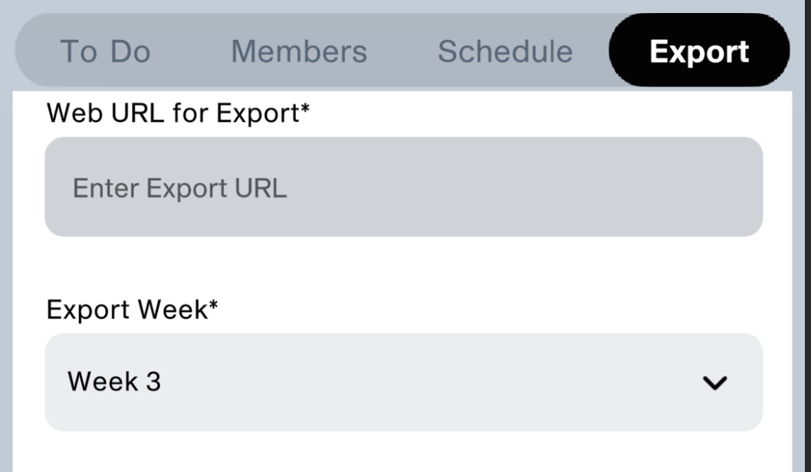
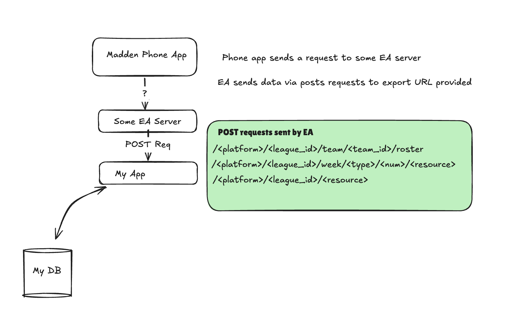

# Reverse engineering the Madden app to have a better user experience

> If you want to go right to my repo and see the project, you can see it [here!](https://github.com/zdenardi/madden_exporter)


My friends and I frequently play the American Football game Madden, and play in something called a "Connected Franchise", that is a franchise where all of us are controlling a team. It's a lot of fun and enjoyable - bar one tiny thing. The GUI for lack of a better term, is a slog to get through. It makes sense, there are a lot of tables and information that needs to be quickly sifted through with a controller...but I think it is safe to say that the GUI could be better. 

There is a companion app that allows a user to see the current week, and the ability to export the league data to a third party source and that is where my interest was piqued. It's just a URL that you can send a request too and I had a great idea...why can't I just export it to my own app?




## How do you make routes for requests that you don't know?

The first biggest hurdle I ran into was the fact is there is zero documentation from EA. So I had to figure out how could I serve an application that saved that information, and what it is, so I could later make the 'actual' routes that I want later.

### Cloudflare Tunnel 

I needed a way to safely open the ports to my app in dev and Cloudflare Tunnel was a perfect solution here. Really easy to do, and gives you a link that you can use to safely tunnel into your machine.

 Highly recommend checking the [docs](https://developers.cloudflare.com/tunnel/) for it.  

 
### Catch All Route

I created a route that took the path that was sent, created a file that took the `path` `method` and `JSON` and saved it as a file. It allowed me to get all the requests, and figure out what was going on

```
@app.route("/<path:path>", methods=["GET", "POST"])
def catch_all(path):
    print("PATH:", path)
    print("METHOD:", request.method)

    data = None
    try:
        data = request.get_json()
    except Exception:
        # This handles cases where content-type might be wrong or body is empty
        pass

    log_entry = {
        "path": path,
        "method": request.method,
        "json_data": data,  # Will contain the parsed JSON or None if none was present/parsed
    }

    # Using a more descriptive filename that includes time and perhaps some unique ID
    filename = f"exports/log_{datetime.datetime.now().strftime('%Y%m%d_%H%M%S')}_{hash(path + request.method)}.json"

    try:
        with open(filename, "w") as f:
            json.dump(log_entry, f, indent=2)
    except Exception as e:
        print(f"Error writing log file: {e}")

    return {"received": path}

```

The response looked something like this 

```
{
  "path": "xbsx/27435432/freeagents/roster",
  "method": "POST",
  "json_data": {
    "rosterInfoList": [
      {...
 ```

Perfect, now I know the request method, and path that the EA servers are looking for, and a nice JSON data object to parse. 

## The Sent Request's 



As you can see from above, the routes that I'm interested in  are as follows 

### <ins>Roster Route</ins>
`/<platform>/<league_id>/team/<team_id>/roster`

This route is specifically used by the Madden Export to capture every roster. To my understanding, the Madden Exporter sends out a POST for every team/free agent 

### <ins>Weekly Stats route </ins>
`/<platform>/<league_id>/week/<type>/<num>/<resource>`

This route is specifically used by the Madden Export to capture every weekly "resource". This includes...

    - Weekly Defensive Stats
    - Weekly Kicking Stats
    - Weekly Passing Stats
    - Weekly Puntng Stats
    - Weekly Rushing Stats
    - Weekly Receiving Stats
    - Weekly "Schedule" information
    - Weekly Team Information
    - Weekly Team Stats information

### <ins>Team Information Route</ins>
`/<platform>/<league_id>/<resource>`

This route is specifically used by the Madden Export to capture every weekly League information or Standings


## What's next? 


Next post I'll make sure I talk about how I parsed that information, and made sqlalchemy models for a Postgres Database. My entire project is on github, and you can see it [here!](https://github.com/zdenardi/madden_exporter)