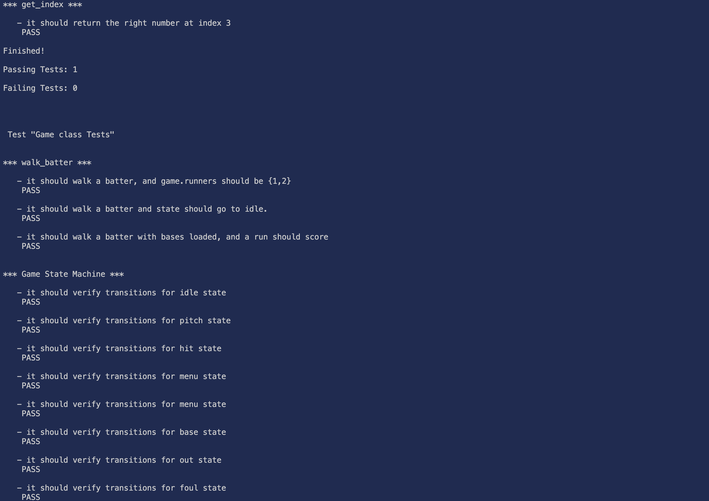

## Pico8 Dev Log - Unit Testing

I was trying to get a feature working in this Pico8 game I'm fiddling with and after having to try to squash a bug, load the cart, try, repeat what felt like a thousand times I thought to myself "Man, I wish Pico8 had unit tests"...and then went on a couple hour journey of making that happen.

## Starting out

First thing I did was do a quick search to see if someone made a library before me and I stumbled upon this [repo.](https://github.com/jozanza/pico-test). Pretty simple code snippet that you can throw into any of your "carts" and test. It has a familiar mocha syntax and I thought it was a pretty good implementation. 

```
function test(title,f)
    local desc=function(msg,f)
    printh('⚡:desc:'..msg)
    f()
end
local it=function(msg,f)
    printh('⚡:it:'..msg)
    local xs={f()}
    for i=1,#xs do
        if xs[i] == true then
        printh('⚡:assert:true')
    else
        printh('⚡:assert:false')
    end
 end
    printh('⚡:it_end')
end
printh('⚡:test:'..title)
f(desc,it)
printh('⚡:test_end')
end
```

The repo is also a JS library that _should_ allow you to run a command in the terminal...but I could never get it to work. So I went about making my own solution.

## Running in terminal 

I wanted the ability to run it in terminal quickly, and through some scouring I found out that Pico8 actually has a headless flag of `-x` which is awesome. So I created another cart, imported all my files in there at the start and can run the command from terminal to load the cart and it will run my tests all heedlessly. Super quick, super efficient. 

The `extcmd( 'shutdown' )` executes the command "shutdown" after 60 frames. 

```
--- test.p8
#include globals.lua
#include test.lua
#include lib.lua
#include start_menu.lua
#include batter.lua
 -- must be before ball
#include pitcher.lua
#include ball.lua
#include main.lua
#include game.lua

--tests
#include tests/lib_tests.lua
#include tests/game_tests.lua

frames = 0


function _draw(
)
    cls()
    print("running tests!")
end

function _init()
end

function _update()
    
  frames += 1

  if frames > 60 then
    extcmd( 'shutdown' )
  end
end
  extcmd( 'shutdown' )
```
So now I have a nice way run all my tests in terminal. I also did an update on the test suite itself to make it look a little better. 

```
function test(title, f)
    local results_file = "test_results.txt"
    local function log(msg)
        printh(msg)
        printh(msg, results_file)
    end

    local passing_tests = 0
    local failing_tests = 0
    local desc = function(msg, f)
        log('\n*** ' .. msg .. ' ***\n')
        f()
    end
    local it = function(msg, f)
        log('   - it ' .. msg)
        local xs = { f() }
        for i = 1, #xs do
            if xs[i] == true then
                passing_tests += 1
                log('    PASS \n')
            else
                failing_tests += 1
                log('    FAIL \n')
            end
        end
    end
    printh("", results_file, true)
    log('\n Test "' .. title .. '"\n')
    f(desc, it)
    log('Finished! \n')
    log('Passing Tests: ' .. passing_tests .. '\n')
    log('Failing Tests: ' .. failing_tests .. '\n')
    log('\n')
end

```

Personally, I think this is easier to read, and looks better in terminal with the added bonus of being able to be saved to a textfile on every run. 



## Whats next? 
I'm hoping to be able to leverage all of this into a GH action, and have passable tests in a CI type of scenario. Might also try to make it a VS extension. Thought it would be a fun side project. Also considering breaking this out into it's own submodule and sharing it on Github. I'll make sure to link it here if I do that.